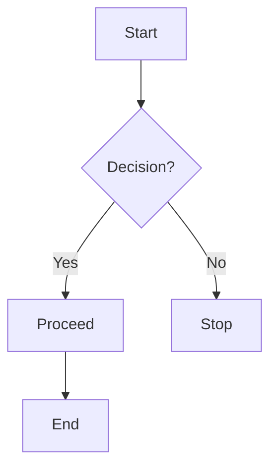
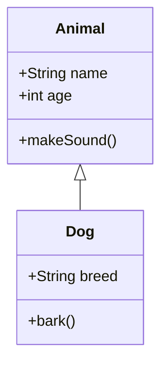
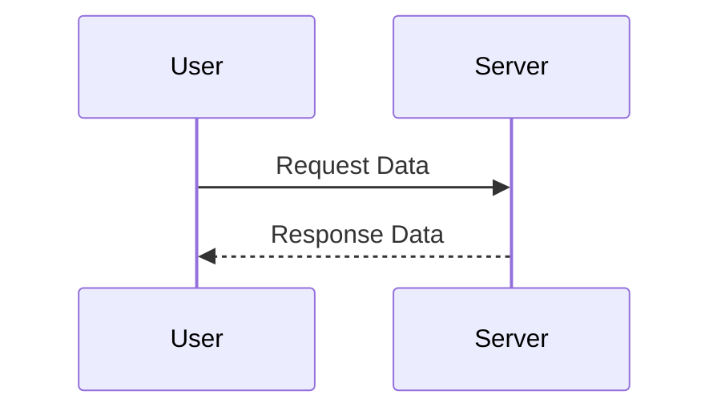
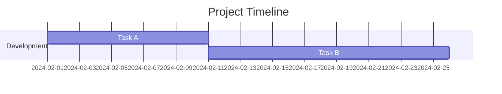

# 📊 Markdown Diagrams

Markdown supports diagrams using **Mermaid.js**, a powerful tool for creating flowcharts, sequence diagrams, class diagrams, and more.

---

## **✅ Flowcharts**
Use `graph TD;` for a **top-down** flowchart.

### **Example:**
````markdown

````

### **Renders as:**


---

## **✅ Class Diagrams**
Use `classDiagram` to define object-oriented structures.

### **Example:**
````markdown

````

### **Renders as:**


---

## **✅ Sequence Diagrams**
Use `sequenceDiagram` to visualize interactions between entities.

### **Example:**
````markdown

````

### **Renders as:**


---

## **✅ Gantt Charts**
Use `gantt` to create **project timelines**.

### **Example:**
````markdown

````

### **Renders as:**


---

## **🚀 Summary**
| Diagram Type | Syntax |
|-------------|--------|
| **Flowchart** | `graph TD;` |
| **Class Diagram** | `classDiagram` |
| **Sequence Diagram** | `sequenceDiagram` |
| **Gantt Chart** | `gantt` |

---

## 🎯 Key Takeaway
_"Mermaid.js allows you to create diagrams directly in Markdown, enhancing documentation with visual clarity."_
