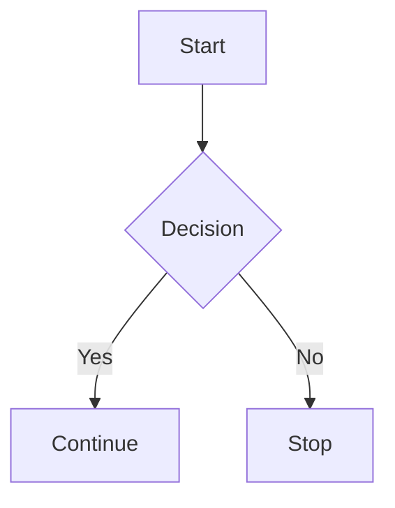

# 🎯 Advanced Markdown Features

Markdown has powerful features that go beyond basic formatting. This guide covers **tables, footnotes, collapsible sections, mathematical expressions, and more!**

---

## **✅ Footnotes**
Footnotes allow you to add references or explanations without cluttering the text.

### **Example:**
```markdown
Markdown is great for documentation[^1].

[^1]: This is a footnote providing more details.
```

### **Renders as:**
Markdown is great for documentation[^1].

[^1]: This is a footnote providing more details.

---

## 📌 Collapsible Sections

??? info "Click to expand"
    Here is some additional information that stays hidden until clicked.

??? success "Expandable Section"
    - ✅ This is a **success message** inside a collapsible block.
    - 💡 You can add **bullet points**, `code`, or **bold text** inside.
    - 🎯 Use it to **hide additional information** and keep your documentation clean.

??? question "How do I install MkDocs?"
    MkDocs is easy to install with pip:

    ```bash
    pip install mkdocs
    ```

    ??? tip "Need a specific theme?"
        Install the **Material for MkDocs** theme:

        ```bash
        pip install mkdocs-material
        ```

    ??? example "Test the local MkDocs server"
        After installing, run the following command:

        ```bash
        mkdocs serve
        ```

        Then visit **http://127.0.0.1:8000/** in your browser.


??? video "Click to watch a YouTube tutorial"

---

## **✅ Task Lists**
Create interactive checklists with `- [ ]` and `- [x]`.

### **Example:**
```markdown
- [x] Completed task
- [ ] Pending task
```

### **Renders as:**
- [x] Completed task
- [ ] Pending task

---

## **✅ Mathematical Expressions (KaTeX / MathJax)**
Markdown supports mathematical notation using **KaTeX** or **MathJax**.

### **Example:**
```markdown
Euler's formula: $$e^{i\pi} + 1 = 0$$
```

### **Renders as:**
Euler's formula: $$e^{i\pi} + 1 = 0$$

---

## **✅ Mermaid Diagrams**
Create flowcharts, sequence diagrams, and more using **Mermaid.js**.

### **Example:**
````markdown

````

### **Renders as:**


---

## **🚀 Summary**
| Feature | Syntax |
|---------|--------|
| **Footnotes** | `[^1]` for references |
| **Collapsible Sections** | `??? info "Title"` |
| **Task Lists** | `- [ ]` for checkboxes |
| **Math Expressions** | `$$e^{i\pi} + 1 = 0$$` |
| **Diagrams** | `mermaid` for flowcharts |

---

## 🎯 Key Takeaway
_"Advanced Markdown features improve documentation readability, organization, and interactivity."_
