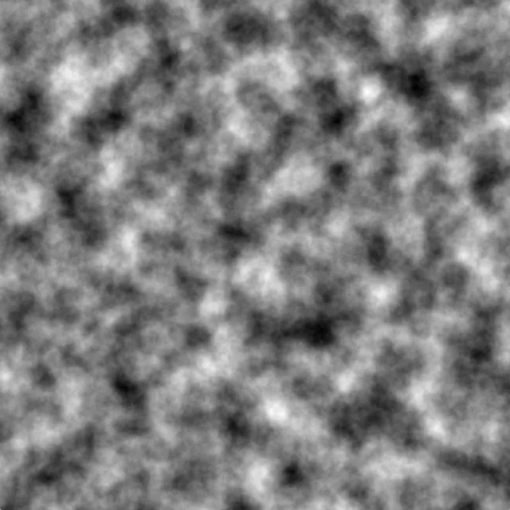
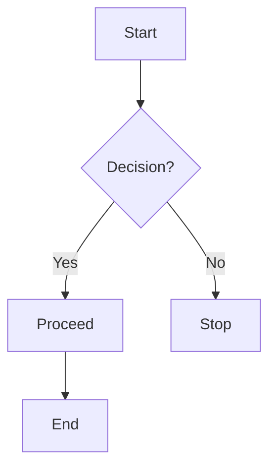
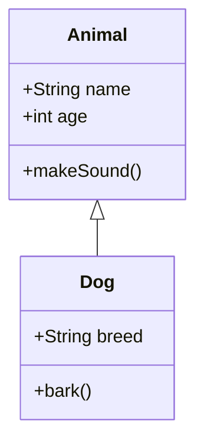

# PerlinNoise

Perlin noise is a type of gradient noise developed by Ken Perlin in 1983. It is widely used in computer graphics to generate natural-looking textures, terrains, and other procedural content. The key characteristic of Perlin noise is that it produces smooth, continuous, and coherent random values.





|  |  |
|:--:|:--:|
| **Perlin Noise** | **Regular Noise** |


---


<style>
  .image-container {
    display: flex;
    justify-content: center;
    gap: 20px;
    margin-top: 20px;
    flex-wrap: wrap; /* Stacks images on smaller screens */
  }

  .image-box {
    text-align: center;
    transition: transform 0.3s ease-in-out;
  }

  .styled-image {
    width: 300px;
    border: 2px solid #ccc;
    border-radius: 10px;
    padding: 5px;
    background: #f9f9f9;
    transition: transform 0.3s ease-in-out, box-shadow 0.3s ease-in-out;
  }

  /* Hover Effect */
  .styled-image:hover {
    transform: scale(1.1); /* Slight zoom effect */
    box-shadow: 0px 5px 15px rgba(0, 0, 0, 0.2);
  }

  .caption {
    font-size: 16px;
    color: #555;
    margin-top: 5px;
  }
</style>

<div class="image-container">
  <div class="image-box">
    
    <p class="caption">Perlin Noise</p>
  </div>
  <div class="image-box">
    
    <p class="caption">Regular Noise</p>
  </div>
</div>

---


## 1. Key Properties of Perlin Noise

**Smoothness:** Perlin noise generates smooth transitions between values, unlike white noise, which is completely random.

**Coherence:** The noise values are coherent, meaning nearby points in space have similar values, creating a natural appearance.

**Scalability:** Perlin noise can be generated at multiple scales (frequencies) and combined to create more complex patterns (e.g., fractal noise).


This document demonstrates various MkDocs features, including **syntax highlighting**, **line numbering**, and **diagrams**.

## ✅ Task List Example

- [x] Install MkDocs
- [x] Create a Markdown file
- [ ] Add more content
- [ ] Deploy the site

## 📌 Collapsible Sections

??? info "Click to expand"
    Here is some additional information that stays hidden until clicked.

??? success "Expandable Section"
    - ✅ This is a **success message** inside a collapsible block.
    - 💡 You can add **bullet points**, `code`, or **bold text** inside.
    - 🎯 Use it to **hide additional information** and keep your documentation clean.

??? question "How do I install MkDocs?"
    MkDocs is easy to install with pip:

    ```bash
    pip install mkdocs
    ```

    ??? tip "Need a specific theme?"
        Install the **Material for MkDocs** theme:

        ```bash
        pip install mkdocs-material
        ```

    ??? example "Test the local MkDocs server"
        After installing, run the following command:

        ```bash
        mkdocs serve
        ```

        Then visit **http://127.0.0.1:8000/** in your browser.


??? video "Click to watch a YouTube tutorial"
    <p align="center">
        <a href="https://www.youtube.com/watch?v=dQw4w9WgXcQ" target="_blank">
            
        </a>
    </p>


Offline Video


## 🐍 Python Code Block

```python
def greet(name: str) -> str:
    """Returns a greeting message."""
    return f"Hello, {name}!"

print(greet("Martin"))
```

## 🔍 Highlighted Lines

You can emphasize specific lines in the code:

```python hl_lines="3 5"
def add(a, b):
    return a + b

result = add(2, 3)
print(result)  # This will print 5
```

## 📌 Code with Line Numbers

Adding line numbers improves readability:

```python linenums="1"
def square(n):
    return n * n

print(square(4))  # Output: 16
```

## 📊 Mermaid Diagram (Flowchart)

If you use **Mermaid.js**, you can create diagrams directly inside MkDocs.



## 📈 UML Diagram (Class Diagram Example)



## ✅ Admonitions (Callout Boxes)

Admonitions help **highlight important information**.

!!! tip "Tip"
    This is a useful tip that appears in a callout box.

!!! warning "Warning"
    Be cautious about syntax errors!

!!! note "Note"
    Remember to use **`mkdocs serve`** to preview changes.

---

## ⚡ Using This Template

1. Copy this **Markdown file** into your MkDocs `docs/` directory.
2. Ensure you have **Material for MkDocs** installed.
3. Start the server with:

   ```bash
   mkdocs serve
   ```

4. Open `http://127.0.0.1:8000/` to view it live.

---

## 🚀 Final Thoughts

This template is **customizable** and works seamlessly with **MkDocs Material**. Feel free to extend it with **more diagrams, tables, and visual elements**.
