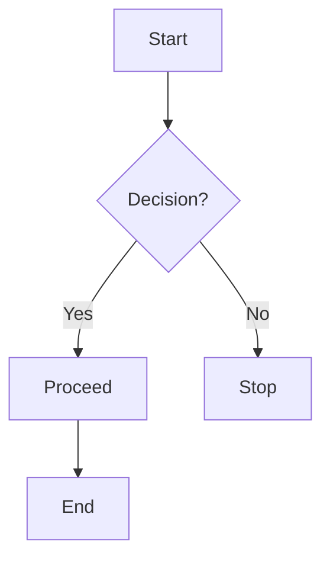
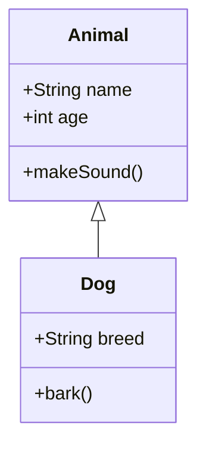

# testDEMO

## MkDocs Code & Visualization Template

This document demonstrates various MkDocs features, including **syntax highlighting**, **line numbering**, and **diagrams**.

## ✅ Task List Example

- [x] Install MkDocs
- [x] Create a Markdown file
- [ ] Add more content
- [ ] Deploy the site

## 📌 Collapsible Sections

??? info "Click to expand"
    Here is some additional information that stays hidden until clicked.

??? success "Expandable Section"
    - ✅ This is a **success message** inside a collapsible block.
    - 💡 You can add **bullet points**, `code`, or **bold text** inside.
    - 🎯 Use it to **hide additional information** and keep your documentation clean.

??? question "How do I install MkDocs?"
    MkDocs is easy to install with pip:

    ```bash
    pip install mkdocs
    ```

    ??? tip "Need a specific theme?"
        Install the **Material for MkDocs** theme:

        ```bash
        pip install mkdocs-material
        ```

    ??? example "Test the local MkDocs server"
        After installing, run the following command:

        ```bash
        mkdocs serve
        ```

        Then visit **http://127.0.0.1:8000/** in your browser.


??? video "Click to watch a YouTube tutorial"
    <p align="center">
        <a href="https://www.youtube.com/watch?v=dQw4w9WgXcQ" target="_blank">
            
        </a>
    </p>


Offline Video


## 🐍 Python Code Block

```python
def greet(name: str) -> str:
    """Returns a greeting message."""
    return f"Hello, {name}!"

print(greet("Martin"))
```

## 🔍 Highlighted Lines

You can emphasize specific lines in the code:

```python hl_lines="3 5"
def add(a, b):
    return a + b

result = add(2, 3)
print(result)  # This will print 5
```

## 📌 Code with Line Numbers

Adding line numbers improves readability:

```python linenums="1"
def square(n):
    return n * n

print(square(4))  # Output: 16
```

## 📊 Mermaid Diagram (Flowchart)

If you use **Mermaid.js**, you can create diagrams directly inside MkDocs.



## 📈 UML Diagram (Class Diagram Example)



## ✅ Admonitions (Callout Boxes)

Admonitions help **highlight important information**.

!!! tip "Tip"
    This is a useful tip that appears in a callout box.

!!! warning "Warning"
    Be cautious about syntax errors!

!!! note "Note"
    Remember to use **`mkdocs serve`** to preview changes.

---

!!! abstract "Abstract"
    A summary of the content that follows.

!!! bug "Bug"
    Highlight a bug or issue that needs fixing.

!!! danger "Danger"
    Critical warnings or severe risks.

!!! error "Error"
    Highlights an error, similar to a warning but more severe.

!!! example "Example"
    Shows an example usage of something.

!!! failure "Failure"
    Used to indicate a failed process or issue.

!!! info "Info"
    A general informational message.

!!! quote "Quote"
    Used to format a blockquote.

!!! question "Question"
    Highlights a common question or FAQ item.

!!! success "Success"
    Indicates a successful action or best practice.

!!! summary "Summary"
    Provides a brief recap of the key points.

!!! hint "Hint"
    Offers a useful hint or trick.

!!! important "Important"
    Emphasizes crucial information.


---

## ⚡ Using This Template

1. Copy this **Markdown file** into your MkDocs `docs/` directory.
2. Ensure you have **Material for MkDocs** installed.
3. Start the server with:

   ```bash
   mkdocs serve
   ```

4. Open `http://127.0.0.1:8000/` to view it live.

---