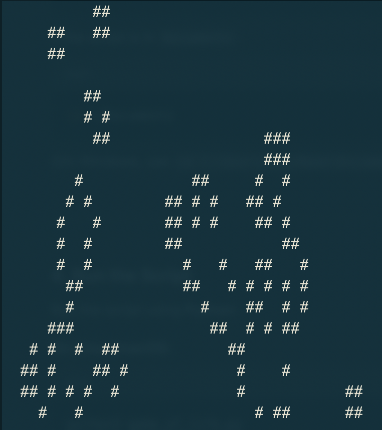

# 🌱 Conway’s Game of Life – A Cellular Automaton

Conway's Game of Life is a **zero-player game** 🎲 created by mathematician **John Conway** in 1970. It is a **cellular automaton**, meaning it consists of a grid of cells that evolve based on a set of simple rules. Despite the simplicity, the game can create incredibly complex patterns.



---

## 🏗️ **1. The Grid & Cells**
- The game runs on a **2D grid** 📊 where each cell can be:
  - **🟢 Alive (1) → Represented by `#`**
  - **⚫ Dead (0) → Represented by a space `' '`**
- The grid updates in **steps (generations) ⏳**.

---

## ⚙️ **2. The Rules**
Each cell’s state in the next generation depends on the **8 neighboring cells** (above, below, left, right, and diagonals).

### 🏚️ **Rule 1: Underpopulation**
- **A live cell with fewer than 2 live neighbors dies.**
  - (Too lonely, it dies. 😢)

### 🏠 **Rule 2: Survival**
- **A live cell with 2 or 3 live neighbors stays alive.**
  - (It has just enough support to live. 🌿)

### 🌋 **Rule 3: Overpopulation**
- **A live cell with more than 3 live neighbors dies.**
  - (Too crowded, it dies. 😵)

### 🍼 **Rule 4: Reproduction**
- **A dead cell with exactly 3 live neighbors becomes alive.**
  - (A new cell is "born" 👶)

---

## 🔄 **3. Example Evolutions**
Here’s how a small **3x3 grid** evolves:

### **Step 1 (Initial State)**
```
. # .
. # .
. # .
```
(Cells are `#` for alive and `.` for dead)

### **Step 2 (Next Generation)**
```
. . .
# # #
. . .
```
(The vertical line **flips horizontally**—this is an oscillator called a **Blinker** 🔁.)

### **Step 3**
```
. # .
. # .
. # .
```
(Back to Step 1—the cycle repeats forever.)

---

## 🔬 **4. Types of Patterns**
### 🏗️ **Still Lifes (Never Change)**
These patterns remain unchanged over time:
- 🟦 **Block** (2x2 square)
- 🏠 **Beehive**

### 🔄 **Oscillators (Repeat in Cycles)**
These patterns switch between states:
- 🔁 **Blinker** (flips every step)
- 🔄 **Toad** (flips every two steps)

### 🚀 **Gliders (Move Across the Grid)**
Some patterns move:
- 🛸 **Glider** (moves diagonally)
- 🚢 **Lightweight Spaceship (LWSS)** (moves horizontally)

### 💥 **Guns & Infinite Growth**
- 🔫 **Gosper Glider Gun** (spawns gliders indefinitely)

---

## 🧐 **5. Why is it Interesting?**
- 🖥️ **It’s Turing complete** (can simulate a computer 🖥️).
- 🏗️ **It shows emergent complexity** (simple rules → complex behavior 🤯).
- 🧬 **It models biological and computational processes 🧠.**

---

## 📝 **Code Example – Implemented in Python** 🐍
📌 Copy and run in the terminal/CLI! 🚀

```python
import curses
import random
import time

def initialize_grid(rows, cols, density=0.2):
    return [[1 if random.random() < density else 0 for _ in range(cols)] for _ in range(rows)]

def count_neighbors(grid, x, y):
    rows, cols = len(grid), len(grid[0])
    neighbors = [
        (-1, -1), (-1, 0), (-1, 1),
        (0, -1),          (0, 1),
        (1, -1), (1, 0), (1, 1)
    ]
    count = 0
    for dx, dy in neighbors:
        nx, ny = x + dx, y + dy
        if 0 <= nx < rows and 0 <= ny < cols:
            count += grid[nx][ny]
    return count

def update_grid(grid):
    rows, cols = len(grid), len(grid[0])
    new_grid = [[0] * cols for _ in range(rows)]
    for x in range(rows):
        for y in range(cols):
            neighbors = count_neighbors(grid, x, y)
            if grid[x][y] == 1 and (neighbors == 2 or neighbors == 3):
                new_grid[x][y] = 1
            elif grid[x][y] == 0 and neighbors == 3:
                new_grid[x][y] = 1
    return new_grid

def draw_grid(stdscr, grid):
    for x, row in enumerate(grid):
        for y, cell in enumerate(row):
            stdscr.addch(x, y, "#" if cell else " ")
    stdscr.refresh()

def game_of_life(stdscr, rows=20, cols=40, delay=0.1):
    curses.curs_set(0)
    stdscr.nodelay(1)
    stdscr.timeout(int(delay * 1000))
    grid = initialize_grid(rows, cols)
    
    while True:
        stdscr.erase()
        draw_grid(stdscr, grid)
        grid = update_grid(grid)
        time.sleep(delay)
        if stdscr.getch() == ord('q'):
            break

if __name__ == "__main__":
    curses.wrapper(game_of_life)

```

---

✨ **Enjoy exploring Conway's Game of Life!** ✨
