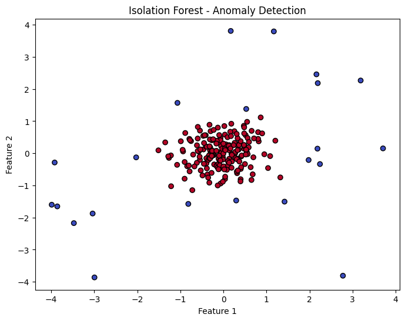
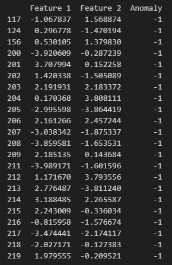

# 🌲 Isolation Forest – Anomaly Detection in Network Traffic

**Isolation Forest (iForest)** is an unsupervised machine learning algorithm used for **anomaly detection**. For instance you can use it to detect **network anomalies**, such as **DDoS attacks, malware behavior, and unusual packet traffic**.

---

## 📌 **1. Why Use Isolation Forest?**
✅ **Works well for real-time detection** 🚀  
✅ **Efficient for large datasets** $O(n \log n)$ complexity  
✅ **Detects outliers** in **network packets, fraud detection, and cybersecurity**  
✅ **No need for labeled data** (Unsupervised)  

---

## 🔍 **2. How Does Isolation Forest Work?**

Unlike traditional clustering-based anomaly detection, **Isolation Forest** works by randomly selecting features and splitting data recursively:

1️⃣ **Randomly selects features** from the dataset.  
2️⃣ **Splits data using decision trees**, isolating samples.  
3️⃣ **Shorter paths → Anomalies (isolated quickly).**  
4️⃣ **Longer paths → Normal points (harder to isolate).**  
5️⃣ **Assigns anomaly scores** based on isolation depth.  

---

## 🖥️ **3. Implementing Isolation Forest in Python**

You can use **scikit-learn** to detect anomalies in **network traffic data**:

```python
import numpy as np
import matplotlib.pyplot as plt
import pandas as pd
from sklearn.ensemble import IsolationForest

# Generate synthetic data
# np.random.seed(42)
X_normal = 0.5 * np.random.randn(200, 2)  # Normal data
X_anomalies = np.random.uniform(low=-4, high=4, size=(20, 2))  # Anomalous data

# Combine normal data and anomalies
X = np.vstack((X_normal, X_anomalies))

# Fit Isolation Forest
model = IsolationForest(contamination=0.1, random_state=42)
model.fit(X)

# Predict anomalies (-1 = anomaly, 1 = normal)
y_pred = model.predict(X)

# Convert data to DataFrame for visualization
df = pd.DataFrame(X, columns=["Feature 1", "Feature 2"])
df["Anomaly"] = y_pred

# Display first few rows of the data
# print(df.head())  # first few rows
print(df.to_string())  # Prints the entire DataFrame

# Visualization
plt.figure(figsize=(8, 6))
plt.scatter(X[:, 0], X[:, 1], c=y_pred, cmap="coolwarm", edgecolors="k")
plt.xlabel("Feature 1")
plt.ylabel("Feature 2")
plt.title("Isolation Forest - Anomaly Detection")
plt.show()

```

---

## 📊 **4. Interpreting Results**
| **Anomaly Label** | **Meaning** |
|----------------|------------|
| **1** | Normal traffic |
| **-1** | **Anomalous packet** (possible attack, unusual behavior) |

Filter detected anomalies:
```python
# Filter out only anomalies (where Anomaly == -1)
anomalies = df[df["Anomaly"] == -1]

# Print anomalies
print(anomalies.to_string())  # Prints all anomalies
```

---

## 🚀 **5. Use Cases for Isolation Forest**
🔹 **Network Traffic Monitoring** – Detects unusual network behavior, like **DDoS attacks**.  
🔹 **Credit Card Fraud** - Detecting fraudulent transactions by spotting irregular spending behavior.
🔹 **Malware Detection** - Finding anomalous system behaviors or software executions.

---

## 🔬 **6. Comparison with Other Anomaly Detection Methods**

| **Method**          | **Best For**                     | **Limitations**                  |
|---------------------|--------------------------------|---------------------------------|
| **Isolation Forest** | Finding outliers in big datasets | Struggles with noisy data |
| **One-Class SVM**  | Detecting clear anomaly patterns | Slow with large datasets |
| **DBSCAN**         | Spotting anomalies in clusters | Doesn't work well with high-dimensional data |
| **LOF** (Local Outlier Factor) | Finding local outliers | Can be slow to compute |


---

## 🛠️ **7. Next Steps**
- 📡 **Train on real packet data** (use **Wireshark**, `scapy`, or `tcpdump` for packet capture).  
- 📊 **Visualize anomalies** using heatmaps or clustering.  
- ⚙️ **Combine with other methods** (e.g., One-Class SVM, DBSCAN) for better accuracy.  

---

## 🎯 **Conclusion**
**Isolation Forest** is an effective and scalable approach for **detecting anomalies**. By leveraging its ability to isolate rare points quickly, it provides a powerful tool for **cybersecurity, fraud detection, and intrusion detection systems**.