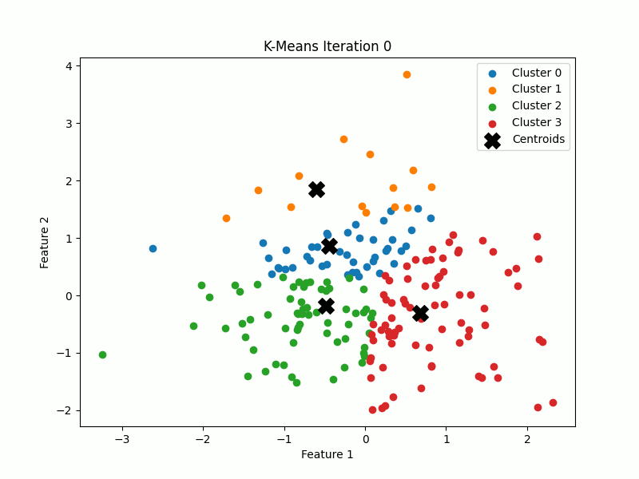
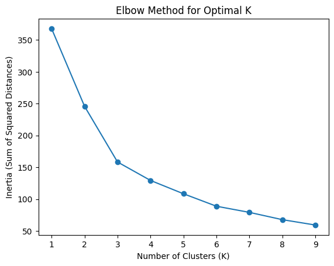

# 🔍 K-Means Clustering – A Guide to Unsupervised Learning  

K-Means Clustering is an **unsupervised machine learning algorithm** used for **grouping data points** into clusters. It is widely used in **pattern recognition, customer segmentation, and anomaly detection**. The algorithm iteratively refines cluster assignments until it reaches an optimal solution.  

  

---

## 🏗️ **1. What is Clustering?**  

Clustering is a way to **group similar data points together** based on shared characteristics. Unlike classification, clustering **does not require labeled data**—it discovers patterns **on its own**.  

- **Example Use Cases:**  
  - 🏪 **Customer Segmentation** (grouping customers based on purchasing behavior)  
  - 🎨 **Image Compression** (grouping similar colors)  
  - 📉 **Anomaly Detection** (detecting unusual patterns in data)  

---

## 📌 **2. How K-Means Works**  

The **K-Means algorithm** follows these key steps:  

1️⃣ **Choose `K` (the number of clusters)**  
   - The user specifies the number of groups (`K`).  

2️⃣ **Initialize `K` random centroids**  
   - The algorithm picks `K` random points from the dataset as initial cluster centers.  

3️⃣ **Assign each point to the nearest centroid**  
   - Each data point is assigned to the closest cluster based on distance, with the most common being **Euclidean distance** (straight-line distance). In some cases, **Manhattan (Taxicab)** distance or **Cosine Similarity** may also be used, depending on the data type and clustering objectives.

4️⃣ **Update the centroids**  
   - The centroid of each cluster is updated to the **mean of all assigned points**.  

5️⃣ **Repeat until convergence**  
   - Steps 3 and 4 repeat until centroids stop changing (or reach a maximum number of iterations).  

  

---

## 🔢 **3. Example of K-Means Clustering**  

Let's say we have the following dataset:  

```
Data Points: 
(2, 3), (3, 3), (4, 4), (8, 7), (7, 8), (9, 6)
```

If `K = 2`, K-Means might create two clusters:  
- **Cluster 1:** [(2,3), (3,3), (4,4)]  
- **Cluster 2:** [(8,7), (7,8), (9,6)]  

After a few iterations, the centroids will stabilize, defining the **final clusters**.

---

## ⚙️ **4. Implementing K-Means in Python**  

Here’s an example of **K-Means clustering with visualization** using NumPy and Matplotlib:

```python
import numpy as np
import matplotlib.pyplot as plt
import os

# Step 1: Generate synthetic dataset
def generate_data(n_samples=200, n_features=2):
    np.random.seed(42)
    return np.random.randn(n_samples, n_features)

# Step 2: Implement K-Means Clustering with Iteration Visualization
class KMeans:
    def __init__(self, k=3, max_iters=100, save_plots=False, output_dir="kmeans_iterations"):
        self.k = k
        self.max_iters = max_iters
        self.centroids = None
        self.save_plots = save_plots
        self.output_dir = output_dir
        
        if self.save_plots and not os.path.exists(self.output_dir):
            os.makedirs(self.output_dir)
    
    def fit(self, X):
        np.random.seed(42)
        self.centroids = X[np.random.choice(X.shape[0], self.k, replace=False)]
        
        for iteration in range(self.max_iters): 
            labels = self._assign_clusters(X)
            new_centroids = np.array([X[labels == i].mean(axis=0) for i in range(self.k)])
            
            self.plot_clusters(X, labels, self.centroids, iteration)
            
            if np.all(self.centroids == new_centroids):
                break
            self.centroids = new_centroids
        
        self.labels_ = self._assign_clusters(X)
    
    def _assign_clusters(self, X):
        distances = np.linalg.norm(X[:, np.newaxis] - self.centroids, axis=2)
        return np.argmin(distances, axis=1)
    
    def plot_clusters(self, X, labels, centroids, iteration):
        plt.figure(figsize=(8, 6))
        for i in range(self.k):
            plt.scatter(X[labels == i, 0], X[labels == i, 1], label=f'Cluster {i}')
        plt.scatter(centroids[:, 0], centroids[:, 1], s=200, c='black', marker='X', label='Centroids')
        plt.title(f'K-Means Iteration {iteration}')
        plt.xlabel('Feature 1')
        plt.ylabel('Feature 2')
        plt.legend()
        
        if self.save_plots:
            filename = os.path.join(self.output_dir, f'iteration_{iteration}.png')
            plt.savefig(filename)
        
        plt.show()
        plt.close()

# Step 3: Run K-Means and visualize iterations
def main():
    X = generate_data(n_samples=200)
    kmeans = KMeans(k=4, save_plots=True)  # Toggle save_plots on/off
    kmeans.fit(X)

if __name__ == "__main__":
    main()

```

📌 **What this code does:**  
✅ Generates **random data**  
✅ **Clusters** the data using K-Means 
✅ **Visualizes** the clusters and centroids  
✅ **Iterates** outputs a picture for each iteration

---

## 🧐 **5. Choosing the Right `K`**  

A common problem in K-Means is selecting the **optimal number of clusters (`K`)**. The **Elbow Method** helps by plotting the **inertia (variance within clusters) vs. number of clusters**.  

### 🔍 **Elbow Method Example**  

```python
import numpy as np
from sklearn.cluster import KMeans
import matplotlib.pyplot as plt

# Generate synthetic data
np.random.seed(42)
X = np.random.randn(200, 2)  # Example dataset

inertias = []
k_values = range(1, 10)

for k in k_values:
    model = KMeans(n_clusters=k, random_state=42).fit(X)
    inertias.append(model.inertia_)

plt.plot(k_values, inertias, marker='o')
plt.xlabel("Number of Clusters (K)")
plt.ylabel("Inertia (Sum of Squared Distances)")
plt.title("Elbow Method for Optimal K")
plt.show()

```



We can see for our dataset of 200 points a k value of 3 or 4 is suitable as greater values show increasingly diminishing returns

📌 **What to look for?**  
- Find the "elbow point" where the curve bends—this suggests the best `K` value.

Also we can use **Visualizing Clusters**, and/or **Silhouette Score**.
---

## 🚀 **6. Strengths & Weaknesses of K-Means**  

### ✅ **Advantages:**  
✔️ **Fast & Efficient** – Scales well to large datasets.  
✔️ **Simple to Implement** – Easy to understand and use.  
✔️ **Works Well for Well-Separated Data** – Performs best when clusters are clearly defined.  

### ❌ **Limitations:**  
⚠️ **Sensitive to Initial Centroids** – Different runs may produce different results.  
⚠️ **Assumes Spherical Clusters** – Doesn’t work well with non-circular shapes.  
⚠️ **Choosing `K` is Tricky** – The correct number of clusters isn't always obvious.  

---

## 🎯 **7. Applications of K-Means**  

- 🏪 **Customer Segmentation** – Grouping customers by behavior.  
- 🎨 **Image Compression** – Reducing color palettes.  
- 📊 **Data Clustering** – Grouping similar records.  
- 🕵️ **Anomaly Detection** – Finding unusual patterns.  

---

## 🏁 **Conclusion**  

K-Means Clustering is a **powerful, simple, and widely used** machine learning algorithm. By iteratively refining cluster assignments, it efficiently **groups data points** into meaningful categories. However, it requires careful selection of **K** and assumes **spherical clusters**.