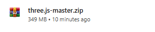
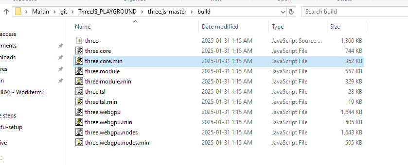
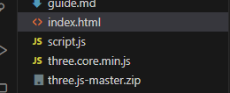
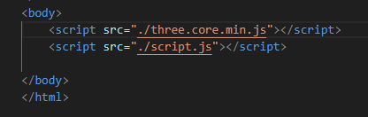
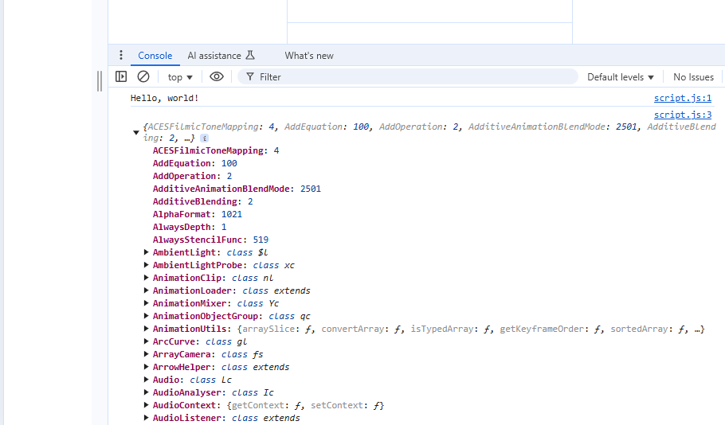

make index.html
use "!" to get default boilerplate
make  section in index.html and make script.js

write console log hello world to ensure everthing is working

open up a browser (i use chrome) go to developer tools and console if you see Hello World! you're good / everything is working

go to threejs.org, go to download and download the library (its big but we only need a small file in it)

large file, upzip it

go into three.js-master/build 

there should be many options but three.core / three.core.min / three.module

there will be several more but i'll be using the "min version" "three.core.min"

copy the script over to your directory

and add it to your index.html
    **** Make sure you load it before your script file, this has the entire three.js library in it, if you dont run it first things wont work (its like trying to drive a car before you order the parts and build it)

use these:
    
    

Not working, instead of downloading it i referenced it from cloud flare

can use this to download the library later!

the THREE object has a LOT of nested objects inside it

---
Next we are going to make a scene (container for the world/universe), a camera(our eyes), and an object

const scene = new THREE.Scene();

Objects: we have
    (Mesh)
        Primative geometries
        Import models
    particles
    lights